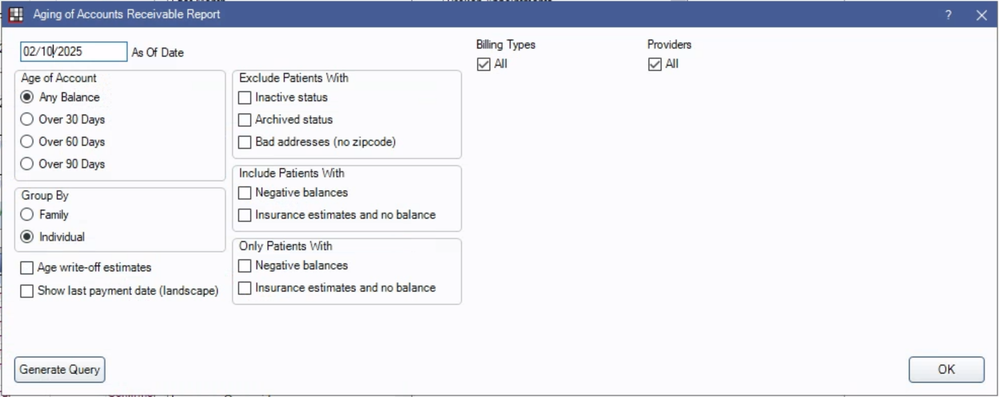

# An Explanation Of This Folder

This folder contains all of my notes dissecting Open Dental's default Aging of A/R report (Reports > Standard > Monthly > Aging of A/R). Because the query used to generate that report contains no less than 6 combined tables and 6 nested SELECT statements, I created a new sql file for each new layer of the "nesting doll" so that I could see what each new SELECT statement was modifying.  

I've also heavily commented this code, but in a way that may not be helpful for others to work with. I'll clean it up if I have time. 

Here are the settings that I used to generate the query:  
